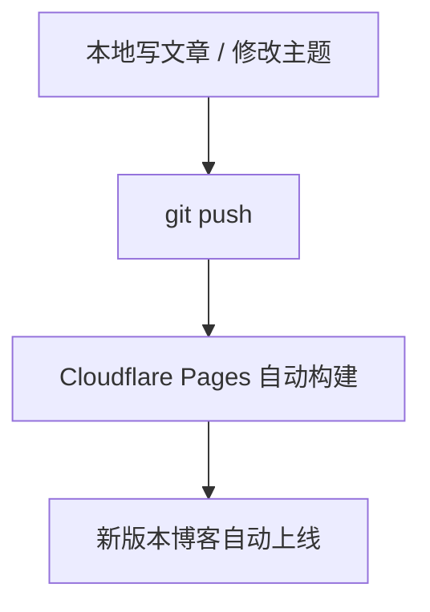

## 背景说明

我之前的博客是部署在 GitHub Pages 上，上线本身没什么问题。

::link-card{title="Xiao wen" url="https://xiaowenmimimi.github.io" desc="mimimi" image="https://cdn.jsdelivr.net/gh/xiaowenmimimi/myImages@main/blog/%E4%BA%91%E5%A8%9C.jpg" badge="Blog"}

在重新搭建 Astro 博客时，我更想要一种省心一点的流程：代码 push 上去之后，**自动构建、自动上线**，出了问题也能直接看部署记录：

所以最终选择了 [**Cloudflare Pages**](https://dash.cloudflare.com/) 作为新的部署平台。

::link-card{title="Cloudflare Pages" url="https://dash.cloudflare.com/" image="https://image.xhwen.cn/blog/cloudflare_logo.webp" badge="Cloudflare"}

:::note[关于为什么选择 Cloudflare Pages]
* 和 GitHub 仓库连起来很顺手，平时只要正常提交代码就能自动部署
* 访问速度稳定，并且免费额度对个人博客非常友好（免费真的是太棒了q(≧▽≦q)）
:::

---

## 最终效果

* 博客已经成功部署到 **Cloudflare Pages**
* 会先拿到一个默认的 `*.pages.dev` 地址用来访问和测试：

> https://your-project-name.pages.dev（可改为自定义域名）

* 后续日常更新也比较省心，正常 `git push` 之后，它就会自己重新构建并上线

反正我图的就是一件事：push 完不用管。

---

## 一、前置条件

开始之前先确认这几样：

* 一个可以在本地成功运行 `pnpm build` (npm 使用 `npm run build` 命令) 的 Astro 项目
* 一个 GitHub 仓库（已 push 代码）
* 一个 Cloudflare 账号

:::tip[相关文档]
> ::link-card{title="Cloudflare Pages Functions 官网" url="https://www.cloudflare.com/zh-cn/" image="https://image.xhwen.cn/blog/cloudflare_logo.webp" badge="Cloudflare"}

> ::link-card{title="Cloudflare Pages 官方文档" url="https://developers.cloudflare.com/pages/" image="https://image.xhwen.cn/blog/cloudflare_logo.webp" badge="Cloudflare"}
:::

---

## 二、Astro 项目配置

### 1. astro.config.mjs 文件配置

如果 **使用 Cloudflare 提供的默认 `*.pages.dev` 域名**，可以保持配置，在项目中找到 `astro.config.mjs` 文件，修改 `site` 配置：

```js title="astro.config.mjs" {4}
import { defineConfig } from "astro/config";

export default defineConfig({
  site: "https://your-project-name.pages.dev",
  ...
});
```

> 没想好域名就先空着。我习惯先把部署跑通，回头再补，不然一开始就卡在域名上。

### 2. 构建输出目录

Astro 默认的构建输出目录是： `dist/`

Cloudflare Pages 会直接使用该目录作为站点发布内容，无需额外配置。

---

## 三、在 Cloudflare Pages 创建项目

### 1. 创建 Pages 项目

* 在 Cloudflare 控制台
* 左侧菜单：Workers 和 Pages
* 创建应用程序


* 选择 **Connect to Git**，并授权 GitHub


* 选择底部的 **Get started**


### 2. 构建配置（关键步骤）

选择你的 Astro 博客仓库


:::important[在 **Build settings** 中填写以下内容：]
| 配置项                    | 推荐值             |
| ---------------------- | --------------- |
| 框架预设       | Astro           |
| 构建命令          | `pnpm build` |
| 构建输出目录 | `dist`          |
:::


> Root directory 一般不用改，除非你把 Astro 项目放在子目录里。

### 3. 保存并首次部署

点击 **保存并部署**，Cloudflare Pages 会自动执行：

1. 拉取 GitHub 仓库代码
2. 安装依赖
3. 执行构建命令
4. 发布站点

部署完成后会拿到一个地址，类似：

> https://fuwari-d9b.pages.dev

:::tip[**成功判断标准：**]
* 能正常打开上述地址
* 首页样式与静态资源加载正常
* 刷新页面不会出现 404
:::

---

## 四、日常更新流程

日常更新：



:::tip[**成功判断标准：**]
* Cloudflare Pages 的 Deploy 状态显示为 *Success*
* 重新打开站点能看到你本次提交带来的改动
:::

:::warning[免费版限制]
* Cloudflare Pages 免费版：**每月 500 次构建**
* 不过对个人博客来说通常绰绰有余啦
:::

---

## 五、绑定独立域名（可选）

> 可以在博客稳定运行后再进行。

### 1. 添加自定义域名

路径：

打开需要配置的项目，进入设置页面，填写自定义域名


### 2. DNS 配置

我当时域名就在 Cloudflare，直接一键添加了 CNAME 记录，指向 `your-project-name.pages.dev`。如果域名在其他服务商，手动加一条就行。

:::note[HTTPS]
* Cloudflare Pages 会自动签发 HTTPS 证书
* 无需手动申请或配置证书
:::