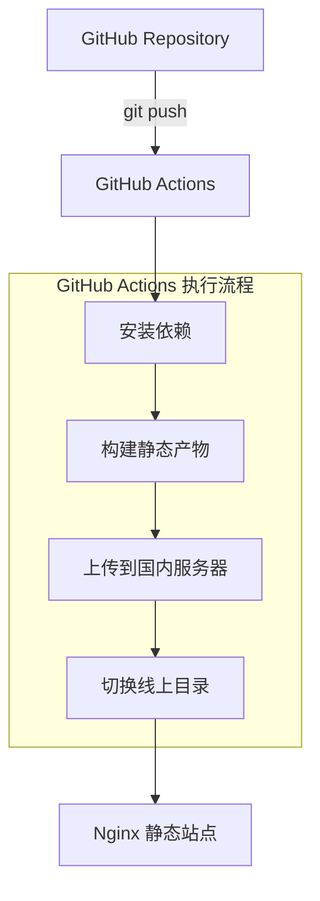

## 背景说明

博客一直放在 **Cloudflare Pages**上，和 GitHub 集成起来方便，push 代码即自动部署。

但 Cloudflare Pages 从中国大陆访问不稳定。迁移到国内又没必要，毕竟海外访问很正常。

目标方案：

- **海外**：Cloudflare Pages
- **国内**：加一台服务器做静态入口，GitHub Actions 自动部署

一份代码，两边各走最合适的入口。

:::important[站内DNS 国内 / 海外分流方案文章]
> ::link-card{title="阿里云 DNS + Cloudflare Pages 实现国内 / 海外分流" url="/posts/blog/dns-geo-split-aliyun-cloudflare/" desc="在使用 Cloudflare Pages 的前提下，为国内提供更稳定、更快的访问入口，并保持整套方案长期可维护。" badge="Blog" target="_self"}
:::

:::tip[其他方案]
DNS 优选和 Workers 分流治标不治本。DNS 优选需要可控源站，Pages 不是这个模式。Workers 分流在请求到达 Cloudflare 后才生效，跨境问题已经发生了。直接加一台国内服务器更实际。
:::

---

## 一、方案概述

### 方案目标

能长期维护是第一位的。

- **国内访问比直连 Cloudflare Pages 稳定**
- **海外继续走 Cloudflare Pages，不丢原有优势**
- **一次 push，两边同时更新**
- **一侧出问题不拖累另一侧**

### 整体架构说明



**Cloudflare Pages** 继续监听同一仓库，由 Cloudflare 独立完成构建和发布。国内服务器由 **GitHub Actions** 单独部署。两条链路独立运行。

---

## 二、服务器部署设计

### 目录结构（版本化）

没有直接覆盖线上目录，用了 `releases + current` 的发布结构：

- 每个部署版本独立目录，方便回滚和排查
- 软链接切换版本，操作更稳妥
- 构建失败不会弄坏当前线上内容

```bash showLineNumbers=false
/var/www/my-site/
├── releases/                    # 每个部署版本都有一个独立目录
│   ├── 20251217093001/
│   ├── 20251218084512/
│   └── ...
└── current -> releases/20251218084512
```

创建并授权：

```bash showLineNumbers=false
mkdir -p /var/www/my-site/releases/
chown -R deploy:deploy  /var/www/my-site/
```

> 新增 `deploy` 部署用户（可用 root，但不建议）

### Nginx 配置示例

> 说明：
> 
> 先用 HTTP（80 端口）跑通整条部署链路。确认能部署、能访问、目录切换没问题后，再补 HTTPS 和跳转配置。

```nginx
<!-- /etc/nginx/conf.d/my-site.conf -->
server {
    listen 80;
    server_name cn.blog.xhwen.cn;       # 域名

    root /var/www/my-site/current;
    index index.html;

    # 静态站：优先找文件/目录，找不到就 404
    location / {
        try_files $uri $uri/ $uri/index.html =404;
    }

    # gzip（只压文本）
    gzip on;
    gzip_vary on;
    gzip_min_length 1024;
    gzip_proxied any;
    gzip_comp_level 6;
    gzip_types
        text/plain text/css text/xml
        application/json application/javascript application/xml
        application/rss+xml image/svg+xml;

    # 静态资源缓存
    location ~* \.(?:css|js|mjs|map|jpg|jpeg|png|gif|webp|svg|ico|woff2|woff|ttf)$ {
        expires 7d;
        add_header Cache-Control "public, max-age=604800";
        access_log off;
        try_files $uri =404;
    }
}
```

测试并加载：

```bash showLineNumbers=false
nginx -t
nginx -s reload
```

服务器仅用于**静态文件托管**，不会参与构建过程。

---

## 三、GitHub 仓库配置（关键）

### 1. 配置 SSH Key（用于部署）

:::important[在**本地**生成部署用密钥：]
```bash  showLineNumbers=false
ssh-keygen -t ed25519 -C "github-actions-deploy"
```

* 私钥：用于 GitHub Actions
* 公钥`.pub`：放到服务器

**把公钥加入服务器：**

```bash  showLineNumbers=false
cat id_ed25519.pub >> ~/.ssh/authorized_keys
```
:::

### 2. GitHub Secrets 配置

:::important[项目配置]
**项目仓库 → Settings → Secrets and variables → Actions → Repository secrets → New repository secret**

新增以下 Secrets：

| 名称                    | 说明             |
| ---------------------- | --------------- |
| `CN_HOST`       | 国内服务器 IP 或域名 |
| `CN_USER`          | SSH 用户名（如 `deploy`） |
| `CN_SSH_PRIVATE_KEY` | **私钥完整内容**（含 BEGIN/END） |
:::


---

## 四、GitHub Actions 自动部署配置

在项目下新建文件：`.github/workflows/deploy-cn-server.yml`

GitHub 会自动识别该路径下的 workflow 文件。

**完整配置**

> 我用的是 `pnpm`，如果项目用 `npm` 对应修改即可。

```yaml
<!-- .github/workflows/deploy-cn-server.yml -->
# Workflow 名称，会显示在 GitHub Actions 页面
name: Deploy to CN Server (Nginx)

# 触发条件
on:
  # 当 main 分支有 push 时自动触发
  push:
    branches: [ main ]

  # 允许在 GitHub Actions 页面手动触发
  workflow_dispatch:

jobs:
  deploy:
    # 使用 GitHub 提供的 Ubuntu Runner
    runs-on: ubuntu-latest

    steps:
      # =========================
      # 1. 拉取仓库代码
      # =========================
      - name: Checkout code
        uses: actions/checkout@v4
        # 作用：
        # - 将当前仓库代码拉到 Runner 本地
        # - 后续 build、rsync 都基于这份代码

      # =========================
      # 2. 安装 pnpm
      # =========================
      - name: Setup pnpm
        uses: pnpm/action-setup@v4

      # =========================
      # 3. 安装 Node.js
      # =========================
      - name: Setup Node.js
        uses: actions/setup-node@v4
        with:
          node-version: 20
          cache: pnpm
        # 作用：
        # - 使用稳定的 Node.js 版本
        # - 启用 pnpm 缓存，加快后续构建速度

      # =========================
      # 4. 安装项目依赖
      # =========================
      - name: Install dependencies
        run: pnpm install --frozen-lockfile
        # --frozen-lockfile：
        # - 确保依赖版本严格与 pnpm-lock.yaml 一致
        # - 防止 CI 中隐式升级依赖

      # =========================
      # 5. 构建 Astro 项目
      # =========================
      - name: Build project
        run: pnpm build
        # 输出结果：
        # - 构建完成后生成 dist/ 目录
        # - dist/ 即最终需要部署到服务器的静态文件

      # =========================
      # 6. 配置 SSH 环境
      # =========================
      - name: Setup SSH
        run: |
          # 创建 SSH 目录
          mkdir -p ~/.ssh

          # 写入私钥（来自 GitHub Secrets）
          echo "${{ secrets.CN_SSH_PRIVATE_KEY }}" > ~/.ssh/id_ed25519
          chmod 600 ~/.ssh/id_ed25519

          # 将服务器加入 known_hosts，避免首次连接交互确认
          ssh-keyscan -H ${{ secrets.CN_HOST }} >> ~/.ssh/known_hosts
        # 作用：
        # - 让 Runner 可以无交互地 SSH 登录服务器
        # - 私钥通过 GitHub Secrets 安全注入

      # =========================
      # 7. 上传构建产物到服务器
      # =========================
      - name: Upload dist to server
        run: |
          # 使用时间戳作为版本号
          TS=$(date +%Y%m%d%H%M%S)
          echo "RELEASE_TS=$TS" >> $GITHUB_ENV

          # 在服务器上创建新版本目录
          ssh ${{ secrets.CN_USER }}@${{ secrets.CN_HOST }} \
            "mkdir -p /var/www/my-site/releases/$TS"

          # 使用 rsync 上传 dist/ 内容
          rsync -az --delete ./dist/ \
            ${{ secrets.CN_USER }}@${{ secrets.CN_HOST }}:/var/www/my-site/releases/$TS/
        # rsync 参数说明：
        # -a：保留文件权限、时间等
        # -z：压缩传输，减少网络开销
        # --delete：保证目标目录与 dist/ 完全一致

      # =========================
      # 8. 原子切换 current 软链接
      # =========================
      - name: Switch current symlink
        run: |
          ssh ${{ secrets.CN_USER }}@${{ secrets.CN_HOST }} "\
            # 将 current 指向最新版本（原子操作）
            ln -sfn /var/www/my-site/releases/${{ env.RELEASE_TS }} /var/www/my-site/current && \
            # 清理旧版本（保留最近 5 个）
            ls -1dt /var/www/my-site/releases/* | tail -n +6 | xargs -r rm -rf \
          "
        # 作用：
        # - ln -sfn：原子切换，不会出现“半更新”状态
        # - 自动清理旧版本，避免磁盘无限增长

```

---

## 五、发布流程

**日常发布**

* 推送 `main` 分支代码到 GitHub 仓库。
* GitHub Actions 自动触发构建与部署。

```bash showLineNumbers=false
git add .
git commit -m "update content"
git push origin main
```

**回滚方式**

服务器执行：

```bash showLineNumbers=false
ln -sfn /var/www/my-site/releases/<旧版本> /var/www/my-site/current
```

---

## 六、常见问题与排查

### 1. Actions 连接不上服务器

* 检查：

  * IP 是否正确
  * SSH 端口是否是 22（如果非 22 需改命令）
  * 私钥是否完整粘贴

### 2. 页面 404 / 没更新

* 确认：

  * Nginx root 指向 current
  * dist/ 是否包含 index.html
  * 是否缓存浏览器（强制刷新一下）