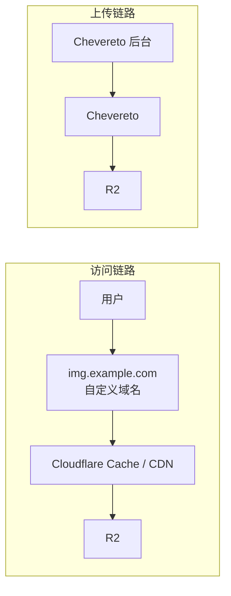

# 背景说明

之前用的 **PicGo + GitHub + Cloudflare** 搭图床，写过一篇记录：

::link-card{title="PicGo + GitHub + Cloudflare 搭建图床" url="/posts/blog/github-image-hosting-with-picgo/" desc="搭建 PicGo + GitHub 图床，并通过 Cloudflare 实现全站 CDN 加速。" badge="Blog" target="_self"}

使用下来发现的几个问题：

- GitHub 仓库不适合长期堆大量图片
- 管理能力弱，只能上传，没法分类整理
- 图片多了迁移和维护都麻烦

这次想搭一个能长期用的图片管理系统。

## 选择 Chevereto + Cloudflare R2 的原因

**Chevereto** 有后台、有相册、支持公开访问，比单纯传图工具完整：

::github{repo="chevereto/chevereto"}

后续想拿来做图库或内容源也顺手。

**Cloudflare R2** 兼容 S3，和对象存储生态对接方便。图片管理和底层存储拆开，后面调整展示层不会把整个链路绑死。

## 实际使用后的补充说明

这套方案比 PicGo + GitHub 更完整，但不是全面升级，各有取舍。

如果只给博客配图、最在意速度和简单，PicGo + GitHub + Cloudflare 的纯静态路线更直接。

我继续用 Chevereto，是因为需要的不只是传图，是一个能扩展的图片系统。

## 整体架构

上传管理和图片访问拆成两条链路——上传走 Chevereto 后台，外部访问走独立图片域名和缓存，后台域名不暴露在图片入口上。

结构：



---

# Chevereto 部署

使用 **Docker 部署**。

## 创建项目目录

```bash showLineNumbers=false
sudo mkdir -p /opt/chevereto
cd /opt/chevereto

sudo mkdir -p data/mysql
sudo mkdir -p data/images
```

## 创建 docker-compose.yml

```bash showLineNumbers=false
sudo vim /opt/chevereto/docker-compose.yml
```

```yaml
<!-- /opt/chevereto/docker-compose.yml -->
services:
  mariadb:
    image: mariadb:11
    container_name: chevereto-db
    restart: unless-stopped
    environment:
      MYSQL_ROOT_PASSWORD: change_this_root_password # MariaDB root 密码
      MYSQL_DATABASE: chevereto # 自动创建的数据库名
      MYSQL_USER: chevereto # 应用连接数据库使用的用户名
      MYSQL_PASSWORD: change_this_db_password # 应用连接数据库的密码
    volumes:
      - ./data/mysql:/var/lib/mysql # 挂载数据库数据目录，防止容器删除后数据丢失

  chevereto:
    image: chevereto/chevereto:latest
    container_name: chevereto
    restart: unless-stopped
    depends_on:
      - mariadb # 先启动数据库，再启动 chevereto
    ports:
      - "8080:80" # 宿主机 8080 映射到容器 80
    environment:
      CHEVERETO_DB_HOST: mariadb # 数据库主机名，对应上面的服务名
      CHEVERETO_DB_USER: chevereto # 数据库用户名
      CHEVERETO_DB_PASS: change_this_db_password # 数据库密码
      CHEVERETO_DB_PORT: 3306 # 数据库端口
      CHEVERETO_DB_NAME: chevereto # 数据库名
      CHEVERETO_MAX_POST_SIZE: 128M # POST 请求大小限制
      CHEVERETO_MAX_UPLOAD_SIZE: 128M # 单次上传大小限制
    volumes:
      - ./data/images:/var/www/html/images # 本地图片目录挂载
```

## 启动容器

```bash showLineNumbers=false
docker compose up -d
```

查看状态：

```bash showLineNumbers=false
docker ps
docker compose logs -f
```

如果两个容器都正常运行，说明本体已经起来了。

:::important[常见问题]
**Chevereto 容器里的 PHP 运行用户 www-data，没有权限写入 /images/ 目录**

> 宿主机上的 `./data/images` 被挂进容器后，容器里的 `www-data` 没法写。

**问题原因**

> Docker 挂载目录时，容器内程序以 `www-data` 身份运行，但宿主机目录可能是 `root:root` 所以容器虽然能看到目录，但不能写入，这在 PHP 程序里很常见。

**解决办法**

项目目录下执行：

```bash showLineNumbers=false
cd /opt/chevereto
sudo chown -R 33:33 ./data/images
sudo chmod -R 775 ./data/images
```

> 这里的 `33:33` 通常就是 Debian/Ubuntu 系里 `www-data` 的 uid/gid。

然后重启容器：

```bash showLineNumbers=false
docker compose restart
```

:::

## 配置 Nginx

Nginx 做反向代理。Chevereto 跑在本机 8080，Nginx 统一处理域名和 HTTPS。

创建站点配置文件（推荐独立文件，便于管理）：

```bash showLineNumbers=false
sudo vim /etc/nginx/conf.d/chevereto.conf
```

```nginx
<!--/etc/nginx/conf.d/chevereto.conf--> 
server {
    # 80 强制跳转到 443
    listen 80;

    server_name chevereto.example.com;

    # HTTP 请求永久重定向到 HTTPS
    return 301 https://$host$request_uri;
}

server {
    listen 443 ssl http2;

    # 当前 HTTPS 站点绑定的域名
    server_name chevereto.example.com;

    # ssl证书配置
    ssl_certificate     /etc/nginx/ssl/chevereto.example.com/fullchain.pem;
    ssl_certificate_key /etc/nginx/ssl/chevereto.example.com/privkey.pem;

    # 关闭 session tickets，减少某些场景下的安全风险
    ssl_session_tickets off;

    # 关闭"优先使用服务端加密套件"设置
    ssl_prefer_server_ciphers off;

    # 日志配置
    access_log /var/log/nginx/chevereto.example.com.access.log;
    error_log /var/log/nginx/chevereto.example.com.error.log warn;

    # 上传大小限制
    client_max_body_size 128M;

    location / {
        proxy_pass http://127.0.0.1:8080;

        proxy_http_version 1.1;
        proxy_set_header Host $host;
        proxy_set_header X-Real-IP $remote_addr;
        proxy_set_header X-Forwarded-For $proxy_add_x_forwarded_for;
        proxy_set_header X-Forwarded-Proto https;
        proxy_set_header X-Forwarded-Host $host;
        proxy_set_header X-Forwarded-Port 443;

        # 与后端建立连接的超时时间
        proxy_connect_timeout 60s;

        # 向后端发送请求的超时时间
        proxy_send_timeout 60s;

        # 等待后端响应的超时时间
        proxy_read_timeout 60s;

        # 关闭代理缓冲
        proxy_buffering off;
    }
}
```

检查并重载 Nginx：

```bash showLineNumbers=false
nginx -t
nginx -s reload
```

## 完成 Chevereto 首次安装

浏览器打开：`https://chevereto.example.com`

进入初始化页面：

完成管理员账号创建


:::tip[修改为中文界面]

:::

---

# 创建 Cloudflare R2 Bucket

## 创建 R2 Bucket

在 Cloudflare 控制台里操作：

1. 点左侧**存储和数据库**

2. 进入 **R2 对象存储**

3. 点击**创建存储桶**


4. 填写存储桶信息，点击**创建**


## 创建 API 密钥

1. 回到 **R2 对象存储**

2. 点击**创建 API 密钥**


> 记录 `S3 API`，后续配置 Chevereto 的 `Endpoint` 时需要。

3. 填写密钥信息，点击**创建**


创建 API 密钥，拿到：

  * Access Key ID (访问密钥 ID)
  * Secret Access Key (机密访问密钥)


:::warning[机密访问密钥]
通常只显示一次。
如果没保存，后面一般只能重新生成。
:::

## 公网访问地址

1. 回到 **R2 对象存储**

2. 进入新建的 **images**，点击**设置**

3. 启用**公共开发 URL**，点击**保存**(生产环境建议使用自定义域名，公共开发 URL 存在限速问题)


---

# 配置 Chevereto 连接 R2

## 进入配置页面

```text showLineNumbers=false
仪表盘 -> 设置 -> Upload storage -> Add 存储
```


## 配置 R2 存储桶

Chevereto 把 R2 当 S3 兼容存储对接。先配通基础连接，确认上传和访问正常，再换自定义域名。

参数：

| 项目                    | 值             |
| ---------------------- | --------------- |
| `API`          | `S3 Compatible` |
| 名称       | `Cloudflare R2` |
| 区域          | `auto` |
| `Bucket`          | `images` |
| 访问密钥 ID        | `Access Key ID` |
| 私有访问密钥        | `Secret Access Key` |
| `Endpoint`          | `S3 API` |
| 存储容量          | `1 TB` |
| `URL`          | R2 自定义域名(测试可用公共开发 URL) |


:::important[保存完成后需要勾选启用存储]

:::

## 部署完成后的访问推荐

图片访问域名与后台域名分离

建议：

* `chevereto.example.com`：Chevereto 管理站，只给自己登录和管理用
* `img.example.com`：专门给博客和外部访问图片用

> 后台和图片分开，后面接缓存、调域名、排错都方便。

---

# 配置定时任务

**Chevereto** 有一些后台清理和维护要靠 cron 跑，容易被忽略。

这些任务包括：

* 清理未确认用户
* 删除过期图片
* 删除待清理存储文件
* 删除废弃上传分片
* 检查更新等

可以加到系统 cron 里，例如每 5 分钟执行一次：

```bash showLineNumbers=false
*/5 * * * * docker exec --user www-data chevereto app/bin/cli -C cron >/dev/null 2>&1
```

前面 compose 里已经指定了容器为 `chevereto`，所以如果你的容器不是 `chevereto`，记得替换掉。

---

# 上传测试图验证连接

接入 R2 后，上传一张图片，检查三件事：

**1. Chevereto 后台能看到图片**

说明应用逻辑正常。

**2. R2 bucket 里出现对象**

说明上传已经真正写进对象存储。

**3. 图片 URL 能直接访问**


说明 Storage URL 和公网访问配置正确。

> 如果第 2 条成功但第 3 条失败，通常问题不在 Chevereto，而在：
> 
> * Storage URL 填错
> * R2 公共访问没开
> * 自定义域名没配好
> * Cloudflare 代理规则不对