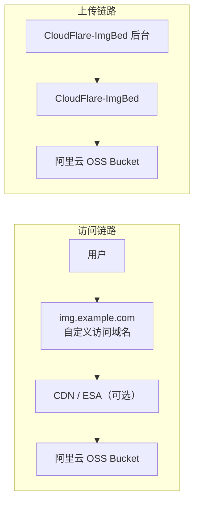

# 背景说明

## 为什么选择 CloudFlare-ImgBed

::github{repo="MarSeventh/CloudFlare-ImgBed"}

- 界面美观好看
- 支持文件管理、目录、鉴权、API，接近完整的托管系统
- 支持多种存储后端
- 对 Cloudflare 生态友好
- 架构灵活：程序本体负责上传、管理和生成链接，对象存储负责保存文件

## 为什么搭配阿里云 OSS

底层存储选了阿里云 OSS，没用 R2：

- 国内访问稳定
- 方便接入阿里云生态
- 自定义域名、权限控制、生命周期规则这些能力成熟
- 后续加 ESA 链路也顺

## 整体架构



---

# CloudFlare-ImgBed 部署

## 方案一：Cloudflare 部署

**官方部署指南：**

::link-card{title="CloudFlare-ImgBed 部署到 Cloudflare" url="https://cfbed.sanyue.de/deployment/cloudflare.html" desc="Cloudflare Pages 是推荐的部署方式，提供免费托管、全球 CDN 加速和无需服务器维护的优势。" badge="CloudFlare-ImgBed" image="https://image.xhwen.cn/blog/cloudflare-imgbed-logo.webp"}

## 方案二：Docker 部署

:::note[官方部署指南]
> 
> ::link-card{title="CloudFlare-ImgBed 部署到 Docker" url="https://cfbed.sanyue.de/deployment/docker.html" desc="Docker 部署适合有自己服务器的用户，提供更多的控制权和自定义能力。" badge="CloudFlare-ImgBed" image="https://image.xhwen.cn/blog/cloudflare-imgbed-logo.webp"}
:::

### 创建项目目录

```bash showLineNumbers=false
sudo mkdir -p /opt/cloudflare-imgbed
cd /opt/cloudflare-imgbed

sudo mkdir -p data
```

> 这里的 `data` 目录用于持久化 CloudFlare-ImgBed 的本地数据。
> 官方 Docker 部署文档里也明确要求把宿主机目录挂载到容器内的 `/app/data`。

### 创建 docker-compose.yml

```bash showLineNumbers=false
sudo vim /opt/cloudflare-imgbed/docker-compose.yml
```

```yaml
# /opt/cloudflare-imgbed/docker-compose.yml
services:
  cloudflare-imgbed:
    image: marseventh/cloudflare-imgbed:latest
    container_name: cloudflare-imgbed
    restart: unless-stopped
    ports:
      - "7658:8080"
    volumes:
      - ./data:/app/data
```

### 启动容器

```bash showLineNumbers=false
docker compose up -d
```

查看状态：

```bash showLineNumbers=false
docker ps
docker compose logs -f
```

## 配置 Nginx

创建站点配置文件：

```bash showLineNumbers=false
sudo vim /etc/nginx/conf.d/cloudflare-imgbed.conf
```

```nginx
# /etc/nginx/conf.d/cloudflare-imgbed.conf
server {
    listen 80;
    # 图床域名
    server_name imgbed.example.com;
    # 将所有 http 请求 301 永久重定向到 https
    return 301 https://$host$request_uri;
}

server {
    listen 443 ssl http2;
    server_name imgbed.example.com;

    # 图床域名 SSL 证书路径
    ssl_certificate     /etc/nginx/ssl/imgbed.example.com/fullchain.pem;
    ssl_certificate_key /etc/nginx/ssl/imgbed.example.com/privkey.pem;

    # 关闭 session ticket，减少某些 TLS 会话复用带来的安全隐患
    ssl_session_tickets off;
    ssl_prefer_server_ciphers off;

    # 日志
    access_log /var/log/nginx/imgbed.example.com.access.log;
    error_log /var/log/nginx/imgbed.example.com.error.log warn;

    # 允许上传的最大请求体大小
    client_max_body_size 128M;

    location / {
      # 代理请求到 CloudFlare-ImgBed 容器
      proxy_pass http://127.0.0.1:7658;

      proxy_http_version 1.1;
      proxy_set_header Host $host;
      proxy_set_header X-Real-IP $remote_addr;
      proxy_set_header X-Forwarded-For $proxy_add_x_forwarded_for;
      proxy_set_header X-Forwarded-Proto https;
      proxy_set_header X-Forwarded-Host $host;
      proxy_set_header X-Forwarded-Port 443;

      # 连接上游超时时间
      proxy_connect_timeout 60s;
      proxy_send_timeout 60s;
      proxy_read_timeout 60s;

      # 关闭代理缓冲
      proxy_buffering off;
    }
}
```

检查并重载 Nginx：

```bash showLineNumbers=false
nginx -t
nginx -s reload
```

## 完成首次初始化

浏览器打开：`https://imgbed.example.com/systemConfig#security`

> 管理后台默认无需密码，登录后请及时设置管理员用户名和密码。

进入后台后，先完成管理员账号、站点标题、上传设置等基础初始化。

确认以下几点：

- 管理后台可以正常登录
- 上传页面可以正常打开
- 系统设置可以正常保存
- 本体服务已经稳定运行


---

# 阿里云 OSS Bucket

## 创建 Bucket

在阿里云 OSS 控制台中：

1. 进入 **OSS 对象存储**
2. 创建 Bucket


| 配置项 | 选择 |
|--------------------|---|
| 模式选择 | 自定义创建，方便手动控制 Bucket 参数 |
| Bucket 名称 | 自定义一个全局唯一名称，例如 `image-example` |
| 地域 | 优先选离服务器或主要用户更近的地域，例如 **华南 3（广州）** |
| 存储类型 | 标准存储 |
| 存储冗余类型 | 同城冗余 |
| 版本控制 | 关闭 |
| 阻止公共访问 | 默认开启，保持默认即可 |
| 读写权限 | 创建时默认只能是私有，创建完成后，关闭阻止公共访问后，可改为公共读 |
| 服务端加密 | 无 |
| 其他高级功能 | 保持默认 |

> 关闭**阻止公共访问**
> 
> 
> 
> 读写权限修改为**公共读**
> 
> 

## 创建访问密钥

CloudFlare-ImgBed 接入阿里云 OSS 需要一组 API 凭证：

- `AccessKey ID`
- `AccessKey Secret`

`AccessKey Secret` 只在创建时显示一次，后续无法查看，创建后立刻保存。

:::note[建议]
不要直接为主账号创建访问密钥，而是专门为图床程序创建一个 RAM 用户。
:::

### 1. 创建 RAM 用户

进入阿里云 **RAM 控制台** → 右上角头像 → **访问控制（RAM）**

创建一个专门给 Chevereto 使用的用户，例如：

* 登录名称：`cloudflare-imgbed-oss`
* 显示名称：`CloudFlare-ImgBed OSS`
* 访问方式：选择 **使用永久 AccessKey 访问**，不勾选控制台登录


创建完成后，系统会生成：

* `AccessKey ID`
* `AccessKey Secret`

请务必立即保存，因为 `AccessKey Secret` 后续无法再次查看。

### 2. 用户绑定权限（最小权限原则）

进入**权限管理** → **权限策略** → 创建**自定义权限策略** -> 选择**脚本编辑**

不要直接给这个用户过大的权限，建议只授予指定 Bucket 的最小必要权限，例如：

* `oss:ListObjects`
* `oss:PutObject`
* `oss:GetObject`
* `oss:DeleteObject`

如果 Bucket 名称为 `image-example`，可以参考下面这份自定义策略：

```json
{
  "Version": "1",
  "Statement": [
    {
      "Effect": "Allow",
      "Action": [
        "oss:ListObjects"
      ],
      "Resource": [
        "acs:oss:*:*:image-example"
      ]
    },
    {
      "Effect": "Allow",
      "Action": [
        "oss:GetObject",
        "oss:PutObject",
        "oss:DeleteObject"
      ],
      "Resource": [
        "acs:oss:*:*:image-example/*"
      ]
    }
  ]
}
```


策略名称：`CloudFlare-ImgBedOSSBucketPolicy`

创建完成后，进入**用户** → **新增授权**

- 资源范围：账号级别
- 授权主体：`cloudflare-imgbed-oss`
- 权限策略：搜索并勾选 `CloudFlare-ImgBedOSSBucketPolicy`
- 确认授权


## 配置 OSS 自定义域名

正式环境更推荐用自定义域名，不建议长期直接暴露默认访问域名。

::link-card{title="通过自定义域名访问 OSS" url="https://www.alibabacloud.com/help/zh/oss/user-guide/access-buckets-via-custom-domain-names" desc="阿里云官方文档通过自定义域名访问 OSS，替代默认域名访问OSS资源。" badge="Aliyun" image="https://image.xhwen.cn/blog/alibabacloud-color.webp"}

---

# 配置 CloudFlare-ImgBed 连接 OSS

CloudFlare-ImgBed 当前支持多种上传渠道，阿里云 OSS 这里走的是 **S3 渠道**。

## 进入配置页面

**管理后台** -> **系统设置** -> **上传设置**

> 管理后台上传设置地址示例：`https://imgbed.example.com/systemConfig#upload`

点击右上角**添加渠道**。

## 配置 OSS 存储桶

### 参考填写

| 项目 | 值 |
|---|---|
| 渠道类型 | `S3` |
| 渠道名称 | 阿里云OSS |
| `Endpoint` | Bucket 对应地域的 OSS Endpoint，广州是 `https://oss-cn-guangzhou.aliyuncs.com` |
| CDN 域名 | 图片对外访问域名，例如 `https://img.example.com` |
| 存储桶名称 | OSS Bucket 名称 |
| 存储桶区域 | 填 **Region ID**。阿里云广州地域的 Region ID 是 `cn-guangzhou`。 |
| 访问密钥 ID | `AccessKey ID` |
| 机密访问密钥 | `AccessKey Secret` |
| PathStyle | 一般先关闭；如遇兼容问题再开启测试 |
| 容量限制 | 无，单位：GB |


:::note[区域和 Endpoint 怎么填]
**最终应该以当前 Bucket 所在地域的官方 Endpoint 为准**
::link-card{title="阿里云服务的地域和Endpoint 列表" url="https://help.aliyun.com/zh/oss/user-guide/regions-and-endpoints?utm_source=chatgpt.com" desc="每个地域都有一个对应的 Endpoint，用于访问 OSS 存储桶。" badge="Aliyun" image="https://image.xhwen.cn/blog/alibabacloud-color.webp"}
:::

> 存储配置保存后，记得启用，否则上传不会走 OSS。

---

# 公共读 OSS（简单方案）

OSS Bucket 设为 **公共读**，图片访问域名绑定到 OSS 或挂 CDN，CloudFlare-ImgBed 的 **CDN 域名** 填公开访问域名。

配置简单、调试成本低，但防盗链和访问控制弱，用户可以绕过访问层直连源站。

---

# 私有 OSS + ESA 私有回源（可选）

公共读方案的短板在于访问控制弱。私有 OSS + ESA 私有回源解决这个问题：

* OSS 不对匿名用户开放
* 无法绕过 ESA 直接访问源站
* 支持防盗链、鉴权、限流和边缘安全控制
* 源站与访问层分离

## 保持 OSS Bucket 为私有

这里不要把 Bucket 改成公共读，保持默认私有即可。

- 禁止匿名用户直接访问 OSS
- 让 ESA 成为唯一的对外访问入口
- 避免用户绕过 ESA 直接刷 OSS 源站

## 在 ESA 中添加 OSS 源站

::link-card{title="阿里云使用ESA加速OSS资源访问" url="https://help.aliyun.com/zh/edge-security-acceleration/esa/user-guide/use-esa-to-accelerate-oss-resource-access" desc="在 ESA 中添加 OSS 源站，用于加速 OSS 资源访问。" badge="Aliyun" image="https://image.xhwen.cn/blog/alibabacloud-color.webp"}

在 ESA 中配置图片域名时：

- **源站类型**：选择 `OSS`
- **源站地址**：填写 Bucket 对应的 **OSS 外网域名**
- **访问类型（Access Type）**：选择
  - `私有访问-同账号`：ESA 和 OSS 在同一个阿里云账号下
  - `私有访问-跨账号`：ESA 和 OSS 不在同一个账号下


> OSS 作为 ESA 源站时，应填写 OSS 外网域名。

:::important[完成 ESA 对私有 Bucket 的授权]
首次启用 **私有 Bucket 回源** 时，ESA 控制台会提示你完成授权。

* 用户本身没有私有 Bucket 的读取权限
* ESA 被授权读取私有 Bucket
* 回源签名由 ESA 自动处理
:::

## CloudFlare-ImgBed 中的 CDN 域名要改成 ESA 域名

在 CloudFlare-ImgBed 的 S3 渠道配置里：**CDN 域名应该写成 ESA 图片域名**

这套架构里：

- **上传目标**：私有 OSS
- **公开访问 URL**：ESA 域名
- **最终图片链接**：CloudFlare-ImgBed 输出的 ESA 链接

---

# 上传测试图验证连接

接入 OSS 后，上传一张测试图，检查三件事：

**1. CloudFlare-ImgBed 后台能看到图片**

应用逻辑正常。

**2. OSS Bucket 里能看到对象**

文件已写入对象存储。

**3. 图片访问 URL 能直接打开**


外部访问链路正常。