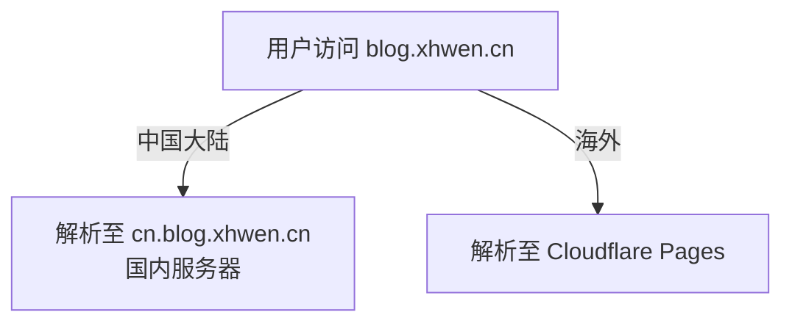

## 背景说明

Cloudflare Pages 的自动化部署和全球 CDN 做得不错，但从国内访问有两个硬伤：

* 跨境网络 RTT 高、稳定性不可控
* 不同运营商、不同时段表现差异大

全量迁移到国内云平台也不划算：

* Cloudflare Pages 的自动化部署就白费了
* 海外访问体验会变差

我的做法是：

> 保留 Cloudflare Pages 服务海外用户，
>
> 国内另起一个入口，
>
> 在 DNS 层按来源地区分流。

:::tip[未采用的方案]
选择 DNS 分流之前，我还看过几个方案：

* Cloudflare Workers 路由反代
* 固定 Cloudflare 优选 IP
* 基于 A / AAAA / CNAME 的 SaaS IP 优选

但 Cloudflare Pages 的情况不同：

* Workers 得等请求到了 Cloudflare 才能处理，解决不了跨境链路问题；
* Cloudflare Pages 是"边缘即源站"，没有固定源站 IP，SaaS 优选不稳、也不好维护；
* 固定优选 IP 绕过了 Cloudflare 的调度，网络环境一变就容易失效。

这几个方案当备用可以，做主架构不合适。
:::

---

## 前置条件

在做 DNS 分流之前，博客已经完成了双端独立部署：

:::note[部署博客方案]
> ::link-card{title="使用 Cloudflare Pages 自动部署 Astro 博客" url="/posts/blog/astro-deploy-cloudflare-pages/" desc="Astro 博客部署教程，从 GitHub 仓库到 Cloudflare Pages 自动部署成功上线的完整流程。" badge="Blog" target="_self"}

> ::link-card{title="GitHub Actions 自动部署 Astro 博客到服务器" url="/posts/blog/astro-deploy-cn-server/" desc="使用 Nginx + GitHub Actions 实现每次 git push main 后，项目自动构建并把最新的静态产物部署到服务器，通过 Nginx 对外提供访问。" badge="Blog" target="_self" }
:::

### 海外入口（Cloudflare Pages）

- 平台：Cloudflare Pages
- 部署内容：Astro 静态博客
- 绑定域名：`blog.xhwen.cn`

Cloudflare Pages 负责：

- 海外用户访问
- GitHub 自动化构建与发布

### 国内入口（阿里云服务器 + Nginx）

- 平台：阿里云 ECS
- 服务：Nginx 静态站点
- 部署内容：同一份 Astro 博客构建产物
- 绑定域名：`cn.blog.xhwen.cn`

国内服务器只做一件事：托管静态文件。不参与构建，不对用户直接暴露。

### 核心原则

> 博客只有一个主站身份：`blog.xhwen.cn`，
>
> `cn.blog.xhwen.cn` 只是国内接入层，
>
> 用户和搜索引擎看到的始终是 `blog.xhwen.cn`。

---

## 一、方案概述

用阿里云 DNS 做国内 / 海外分流：

> `blog.xhwen.cn` 的解析全部交给阿里云 DNS，
>
> 在 DNS 层按地区分流，
>
> Cloudflare Pages 只管海外流量。

**域名角色划分**

| 域名                    | 角色             |
| ---------------------- | --------------- |
| `blog.xhwen.cn`       | 主站域名（唯一对外） |
| `cn.blog.xhwen.cn`          | 国内入口（接入层） |

**访问路径逻辑**



- 用户始终访问 `blog.xhwen.cn`
- DNS 决定实际命中的物理入口
- 页面内容完全一致

---

## 二、阿里云 DNS 配置

### 确保 `blog.xhwen.cn` 由阿里云 DNS 管理

在阿里云 DNS 控制台中：

- 添加解析域名：`blog.xhwen.cn`
- 进入该域名的解析管理页面

### 配置线路解析

:::important[中国大陆线路]
| 项目   | 值                  |
| ---- | ------------------ |
| 记录类型 | CNAME              |
| 主机记录 | `@`                |
| 解析线路 | 中国大陆               |
| 记录值  | `cn.blog.xhwen.cn` |
| TTL  | 10            |
:::


:::important[海外线路]
| 项目   | 值                                         |
| ---- | ----------------------------------------- |
| 记录类型 | CNAME                                     |
| 主机记录 | `@`                                       |
| 解析线路 | 境外                                        |
| 记录值  | Cloudflare Pages 提供的域名（如 `xxx.pages.dev`） |
| TTL  | 10                                   |
:::


:::warning[Cloudflare Pages 注意事项]
Cloudflare Pages 必须配置对应的自定义域名。

> 阿里云 DNS 的 CNAME 只是把域名解析到 Cloudflare，
> 但 Cloudflare 只有配置了对应自定义域名后，才会为该域名签发证书、建立路由，把请求转发到对应的 Pages / Worker。
> 否则 Cloudflare 不知道这个域名该指向哪个服务，会直接拒绝或返回错误。
:::

---

## 三、Astro 与服务器侧注意事项

### Astro 的 site 配置

```js showLineNumbers=false title="astro.config.mjs"
site: "https://blog.xhwen.cn/"
```

- `blog.xhwen.cn` 是主站域名，用户直接访问的就是它
- 不随部署环境变化
- 避免 SEO / canonical 混乱

### 国内 Nginx 的职责约束

国内服务器只做接入层：

- 不主动跳转到 `cn.blog.xhwen.cn`
- 不生成绝对 URL
- 只返回静态文件

（可选）防止被搜索引擎收录：

```nginx showLineNumbers=false
add_header X-Robots-Tag "noindex, nofollow";
```

---

## 四、验证效果

### 方法一：响应头验证

编辑国内站点的 Nginx 配置，找到 `cn.blog.xhwen.cn` 对应的 server 块：

```bash showLineNumbers=false
sudo vi /etc/nginx/conf.d/blog.conf
```

在 `server {}` 里任意位置加一行：

```nginx showLineNumbers=false
add_header X-Edge-From "CN-Nginx";
```

重载 Nginx：

```bash showLineNumbers=false
sudo nginx -t
sudo nginx -s reload
```

**验证方法**

打开浏览器 → 开发者工具（F12）

- 刷新页面
- 在 Network 标签页查看响应头
- 点第一个 Document 请求（`blog.xhwen.cn`）

看 Response Headers：

- 国内网络下你应该看到：

``` text showLineNumbers=false
X-Edge-From: CN-Nginx
```

- 海外网络 / VPN 下不应该看到这个头
- URL 完全一样，Header 不一样 = 分流成功

### 方法二：DNS 解析验证（Windows / macOS / Linux）

在不同 DNS 服务器下查询 `blog.xhwen.cn` 的解析结果。

**Windows（cmd）：**

```cmd
nslookup blog.xhwen.cn 223.5.5.5   # 国内
nslookup blog.xhwen.cn 1.1.1.1     # 海外
```

**macOS / Linux：**

```bash
dig blog.xhwen.cn @223.5.5.5   # 国内
dig blog.xhwen.cn @1.1.1.1     # 海外
```

对比 canonical name，不一样就说明分流生效了。

---

## 总结

阿里云 DNS 的线路解析，不动 Cloudflare Pages 现有部署，就能做到：

- 国内用户自动走国内服务器，加载更快
- 海外用户自动走 Cloudflare Pages，全球 CDN 加速
- 多入口对用户透明，URL 始终是 `blog.xhwen.cn`

:::note[未分流前]

:::

:::note[分流后]

:::