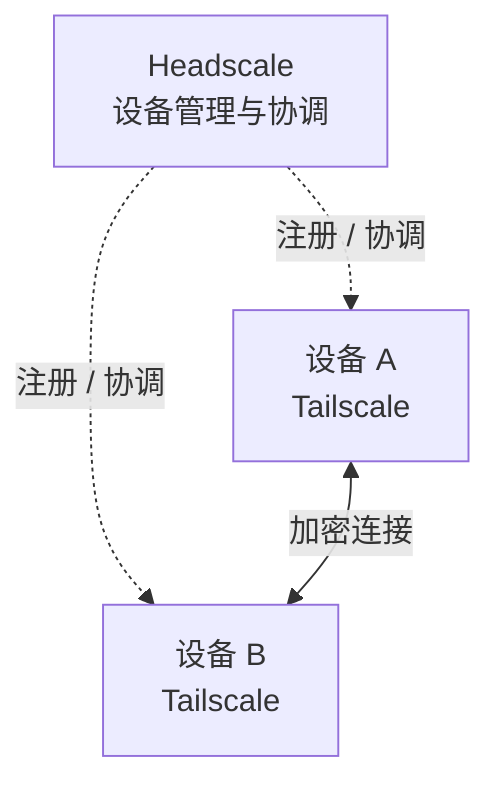
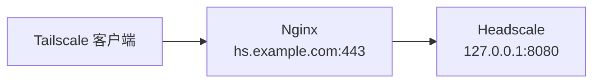

# 背景说明

家里的设备和在外面的笔记本不在同一个网络。以前想让它们互相访问，要么折腾公网 IP 和端口映射，要么自己搭一套 VPN。

Tailscale 基于 WireGuard，能把不同网络里的设备组成一个私有网络，用虚拟 IP 或主机名直接通信。

Tailscale 默认连接官方控制服务器。我使用 Headscale 自建控制端，把部署时用到的配置和命令记录下来。

两者的分工：

- Tailscale：跑在设备上的客户端，负责建立加密连接和传输数据
- Headscale：自建的控制服务器，负责设备注册、节点发现、身份和路由管理



> 这里只自建了控制端。节点直连不上时，流量还是走 Tailscale 官方的 DERP 中继，中继也想自己掌控的话，得额外配 DERP 和 STUN。

---

# 准备环境

这次部署用到的环境：

- 服务器系统：Ubuntu 24.04 LTS
- Headscale 版本：0.29.3
- Tailscale 客户端：v1.80.0 或更高
- 反向代理：Nginx
- 域名：准备一个域名，例如 `hs.example.com`，用于解析到服务器公网 IP
- 开放端口：`22/tcp`、`80/tcp`、`443/tcp`

---

# Headscale 安装和配置

::github{repo="juanfont/headscale"}

## 安装 Headscale

下载并安装官方 `.deb`：

```bash showLineNumbers=false title="v0.29.3 版本"
wget -O headscale.deb https://github.com/juanfont/headscale/releases/download/v0.29.3/headscale_0.29.3_linux_amd64.deb

sudo apt install ./headscale.deb
```

检查版本：

```bash showLineNumbers=false
headscale version
```

## 配置 Headscale

安装完成后，配置文件在：

```bash showLineNumbers=false
/etc/headscale/config.yaml
```

动手前先留一份备份：

```bash showLineNumbers=false
sudo cp /etc/headscale/config.yaml /etc/headscale/config.yaml.bak

sudo vi /etc/headscale/config.yaml
```

**1. 配置访问地址**

假设域名是 `hs.example.com`：

```yaml showLineNumbers=false
<!-- /etc/headscale/config.yaml -->
server_url: https://hs.example.com
```

> 客户端登录时会连接 `server_url` 指定的地址。域名或协议填错，登录就会失败。

**2. 配置监听地址**

我把 TLS 交给 Nginx 处理，Headscale 只监听本机：

```yaml showLineNumbers=false
<!-- /etc/headscale/config.yaml -->
listen_addr: 127.0.0.1:8080
```

请求路径：



**3. 数据库**

Headscale 默认使用 SQLite，设备和用户等信息保存在：

```text showLineNumbers=false
/var/lib/headscale/db.sqlite
```

## MagicDNS 配置（可选）

启用 MagicDNS 后，可以用设备名访问其他设备，不用记虚拟 IP。

假设设备名是 A 和 B，对应域名就是 `A.tail.example.com` 和 `B.tail.example.com`。

```yaml
<!-- /etc/headscale/config.yaml -->
dns:
  magic_dns: true
  base_domain: tail.example.com
  override_local_dns: true
  nameservers:
    global:
      - 1.1.1.1
      - 223.5.5.5
  search_domains: []
```

`nameservers.global` 里的上游 DNS 会下发给所有设备。

> `override_local_dns` 默认是 `true`，客户端接受 DNS 配置后，普通域名查询都会走这里设置的上游 DNS。如果没配上游 DNS，可能出现虚拟 IP 能连、普通域名却解析不了的情况。

改完先检查配置，再重启服务：

```bash showLineNumbers=false
sudo headscale configtest
sudo systemctl restart headscale
```

:::warning[注意]
1. MagicDNS 使用的域名 `tail.example.com` 必须和 Headscale 的服务域名 `hs.example.com` 不同。

2. 客户端要允许 Tailscale 接管 DNS（默认启用），MagicDNS 才会生效：

```bash showLineNumbers=false
sudo tailscale set --accept-dns=true
```
:::


## 启动 Headscale

检查配置：

```bash showLineNumbers=false
sudo headscale configtest
```

确认没有报错后，重启服务并设置开机启动：

```bash showLineNumbers=false
sudo systemctl restart headscale

sudo systemctl enable headscale
```

查看运行状态：

```bash showLineNumbers=false
sudo systemctl status headscale
```

## 创建 Headscale 用户

创建用户：

```bash showLineNumbers=false
sudo headscale users create <USERNAME>
```

查看用户：

```bash showLineNumbers=false
sudo headscale users list
```

---

# 配置 Nginx

安装：

```bash showLineNumbers=false
sudo apt install nginx
```

创建配置：

```bash showLineNumbers=false
sudo vi /etc/nginx/sites-available/headscale
```

```nginx
<!-- /etc/nginx/sites-available/headscale -->
upstream headscale {
    server 127.0.0.1:8080;
}

map $http_upgrade $connection_upgrade {
    default keep-alive;
    '' close;
}

server {
    listen 80;
    server_name hs.example.com;

    location / {
        return 301 https://$server_name$request_uri;
    }
}

server {
    listen 443 ssl;
    server_name hs.example.com;

    # 需要配置域名的公钥和私钥
    ssl_certificate /etc/nginx/ssl/hs.example.com/fullchain.pem;
    ssl_certificate_key /etc/nginx/ssl/hs.example.com/privkey.pem;

    location / {
        proxy_http_version 1.1;

        proxy_set_header Upgrade $http_upgrade;
        proxy_set_header Connection $connection_upgrade;

        proxy_set_header Host $host;
        proxy_set_header X-Real-IP $remote_addr;
        proxy_set_header X-Forwarded-For $proxy_add_x_forwarded_for;
        proxy_set_header X-Forwarded-Proto $scheme;

        proxy_buffering off;

        proxy_pass http://headscale;
    }
}
```

启用：

```bash showLineNumbers=false
sudo ln -s /etc/nginx/sites-available/headscale \
           /etc/nginx/sites-enabled/headscale
```

检查并重启：

```bash showLineNumbers=false
sudo nginx -t
sudo nginx -s reload
```

最后访问健康检查接口：

```bash showLineNumbers=false
curl https://hs.example.com/health
```

> 能正常返回结果，说明公网已经可以访问 Headscale。

---

# Tailscale 安装和配置

::github{repo="tailscale/tailscale"}

:::note[下载地址]
> 
> ::link-card{title="Tailscale Download" url="https://tailscale.com/download" image="https://image.xhwen.cn/blog/tailscale.webp" badge="Tailscale"}
:::

## Windows 客户端

安装 Tailscale 客户端后，在 PowerShell 或 CMD 里执行：

```powershell showLineNumbers=false
tailscale login --login-server https://hs.example.com
```

:::warning[注意]
默认的登录命令会接受 Headscale 下发的 DNS 配置，MagicDNS 也就能用了。

如果这台 Windows 机器已有内网 DNS，或者 TUN 模式代理也在接管解析，登录时加上 `--accept-dns=false`，避免两边抢 DNS：

```powershell showLineNumbers=false
tailscale login --login-server https://hs.example.com --accept-dns=false
```

已经登录过的机器不用重新登录，直接改就行：

```powershell showLineNumbers=false
tailscale set --accept-dns=false
```

> 这只改变本机的 DNS 设置，不影响其他节点。此时访问其他设备可以用虚拟 IP；临时要查 MagicDNS 名称，也可以指定解析器：`nslookup A.tail.example.com 100.100.100.100`。
:::


登录命令会给出一个链接，用浏览器打开就是 Headscale 的设备注册页面。

页面里会显示这台设备的 `Auth ID` 和对应的注册命令。


回到服务端注册：

```bash showLineNumbers=false
sudo headscale auth register \
  --user <USERNAME> \
  --auth-id <AUTH_ID>
```

注册完成后，确认节点已经出现：

```bash showLineNumbers=false
sudo headscale nodes list
```

> 一个 Headscale 用户可以关联多台设备，后面的 Linux 设备继续注册到同一个用户下就行。

## Linux 客户端

安装 Tailscale：

```bash showLineNumbers=false
curl -fsSL https://tailscale.com/install.sh | sh
```

执行：

```bash showLineNumbers=false
sudo tailscale up --login-server https://hs.example.com
```

:::warning[注意]
Linux 上默认同样接受 Headscale 下发的 DNS，想用 MagicDNS 就保持上面的命令。

如果这台机器已有自己的解析配置，比如内网 DNS 或 TUN 模式代理，登录时可以关闭 DNS 接管：

```bash showLineNumbers=false
sudo tailscale up --login-server https://hs.example.com --accept-dns=false
```

已经登录过的机器不用重新登录，直接改就行：

```bash showLineNumbers=false
sudo tailscale set --accept-dns=false
```

> 关闭后仍可用虚拟 IP 连其他设备，不会影响其他节点的 MagicDNS。要临时查询设备名，可指定 Tailscale 的解析器：`nslookup A.tail.example.com 100.100.100.100`。
:::

`tailscale up` 同样会在终端给出注册信息，回到服务端批准：

```bash showLineNumbers=false
sudo headscale auth register \
  --user <USERNAME> \
  --auth-id <AUTH_ID>
```

查看当前状态：

```bash showLineNumbers=false
tailscale status
```

## 使用预授权密钥注册

上面的方式每加一台设备都要回服务器执行一次 `auth register`。设备少时没什么，连续装好几台就有点麻烦了。

这时可以提前生成预授权密钥（Pre-auth Key）。客户端带着密钥登录，服务端不需要再手动批准。

先查出用户 ID：

```bash showLineNumbers=false
sudo headscale users list
```

创建密钥：

```bash showLineNumbers=false
sudo headscale preauthkeys create \
  --user <USER_ID> \
  --reusable \
  --expiration 24h
```

- `--user`：用户 ID，不是用户名
- `--reusable`：可重复使用，不加则只能用一次
- `--expiration`：有效期，默认 1 小时

:::warning[注意]
从 0.26 版本开始，`preauthkeys` 的 `--user` 只接受用户 ID，填用户名会直接报错。

`--reusable` 虽然省事，但密钥一旦泄露，在有效期内就能被反复用来注册设备。
:::

查看已创建的密钥：

```bash showLineNumbers=false
sudo headscale preauthkeys list --user <USER_ID>
```

客户端使用密钥登录：

```bash showLineNumbers=false
tailscale up \
  --login-server https://hs.example.com \
  --authkey <AUTH_KEY>
```

---

# 连通性验证

设备注册完，先看一下节点状态：

```bash showLineNumbers=false
sudo headscale nodes list
```

在任意一台设备上查看自己的虚拟 IP：

```bash showLineNumbers=false
tailscale ip -4
```

测试到另一台设备的连通性：

```bash showLineNumbers=false
tailscale ping <IP>
```

返回结果里会写明这次连接走的路径：

- `via DERP(xxx)`：走中继服务器转发
- `via 公网 IP:端口`：已经建立点对点直连

刚连上时先走一次 DERP，紧接着切换成直连很常见，这说明打洞成功了。如果多次测试始终停在 DERP，再去检查 NAT 类型和防火墙。

> 能互相 ping 通，私有组网就算搭好了，两台设备在不在同一个局域网都不影响。

组网搭好之后，虚拟 IP 和普通局域网 IP 是等价的。SSH、文件共享、Web 服务都不需要为 Tailscale 做额外适配，把原来的地址换成 `100.64.x.x` 或者 MagicDNS 域名就行。

---

# 日常运维

## 节点管理

```bash showLineNumbers=false
# 查看所有节点
sudo headscale nodes list

# 重命名节点
sudo headscale nodes rename --identifier <NODE_ID> <新名称>

# 让节点密钥过期，强制重新登录
sudo headscale nodes expire --identifier <NODE_ID>

# 删除节点
sudo headscale nodes delete --identifier <NODE_ID>
```

## 查看日志

```bash showLineNumbers=false
sudo journalctl -u headscale -f
```

## 备份

我会备份下面这些内容：

```text showLineNumbers=false
/etc/headscale            配置文件和策略文件
/var/lib/headscale        数据库和服务端密钥
```

打包备份：

```bash showLineNumbers=false
sudo systemctl stop headscale

sudo tar -czf /root/headscale-backup-$(date +%F).tar.gz \
  /etc/headscale \
  /var/lib/headscale

sudo systemctl start headscale
```

## 升级

:::warning[注意]
Headscale 要求按小版本依次升级，例如 0.27.x → 0.28.x → 0.29.x，不能跨版本跳。每一步都选该小版本最新的补丁版本，升级前先看一眼对应的 Release Notes。
> 
> ::link-card{title="Upgrade an existing installation" url="https://headscale.net/stable/setup/upgrade/" badge="Headscale"}
:::

升级前先备份，然后下载新版本的 `.deb` 安装：

```bash showLineNumbers=false
wget -O headscale.deb https://github.com/juanfont/headscale/releases/download/v<VERSION>/headscale_<VERSION>_linux_amd64.deb

sudo apt install ./headscale.deb
```

检查配置并重启：

```bash showLineNumbers=false
sudo headscale configtest

sudo systemctl restart headscale

headscale version
```

升级完成后，确认节点都还在：

```bash showLineNumbers=false
sudo headscale nodes list
```
